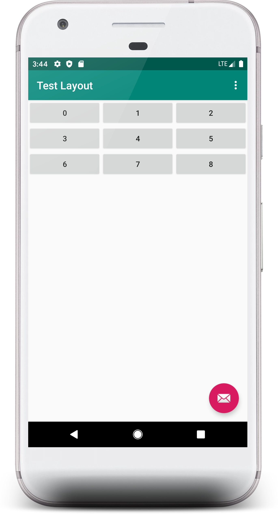
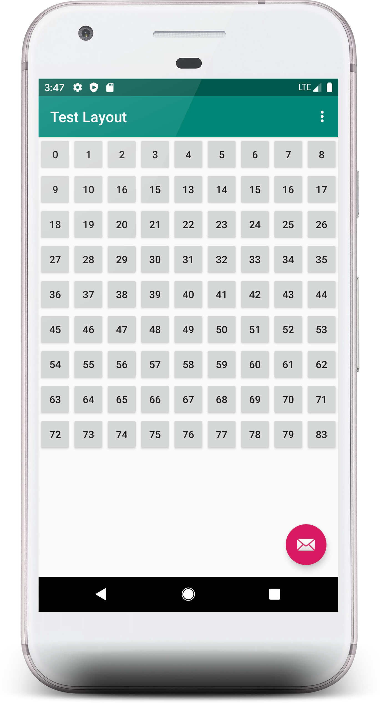
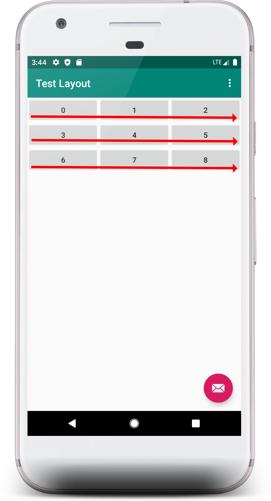

# FastLayout
A library for putting views in rows and columns

[  ](https://bintray.com/alihamuh/AndroidRepo/fastTableLayout/1.1.0/link)
[ ](https://opensource.org/licenses/mit-license.php)

With this library you can put your desired views in tabular form with just a few lines of code.



<h3>Usage</h3>

<h4>Step 1</h4>

In you layout.xml put the fastlayout View with attributes:
```xml
    <com.alihamuh.fastTableLayout.FastLayout
        android:id="@+id/rows"
        android:layout_width="match_parent"
        android:layout_height="wrap_content"
        android:orientation="vertical"
        app:square_size="9"
        app:cell_view="@layout/cell_view">

    </com.alihamuh.fastTableLayout.FastLayout>
```
	
You can use square_size for equal no of rows and columns or you can use no_of_columns and no_of_rows 
for un equal no of rows and columns.

You can define cell_view which can be your custom view for every cell here or in java. 

<h4>Step 2</h4>

```java
     FastLayout view= findViewById(R.id.rows);


        ArrayList<FastAttributes> attributes=new ArrayList<>();
        for(int index=0;index<81;index++){
            FastAttributes attr=new FastAttributes();

            attr.setButtonText(Integer.toString(index));   //text attribute of your view

            View.OnClickListener onClickListener= new View.OnClickListener() {
                @Override
                public void onClick(View v) {
                   ////your code////////
                }
            };

            attr.setOnClickListener(onClickListener);

            attributes.add(attr);
        }

        view.setFastAttributesList(attributes);     
```
You can access fastLayout in java and set its rows and columns. 

If you want to change attribues of all the cells like color, text, onClick etc you can do so in a for loop equal to your square size i.e 
rowxcol. The attributes are entered in the list in a linear manner i.e row by row like this:

 

<h3>Setup:</h3>

<h4>Gradle:</h4>

Enter this in your build.gradle file:

	implementation 'com.alihamuh.fastTableLayout:fastTableLayout:<latest-version>'

and use the library.

**Note: `<latest-version>` value can be found on the JitPack badge above the preview images.**

<h3>Documentation</h3>

<h4>Class FastLayout</h4>

| Method | Description|
|------------ | -------------|    
setFastAttributesList(java.util.ArrayList<FastAttributes> fastAttributesList) | sets an ArrayList of attributes for all your cell views  setNoOfColumns(java.lang.Integer noOfColumns) | Sets no of columns for your cells 
setNoOfRows(java.lang.Integer noOfRows)       | Sets no of rows for your cells 
setSquareSize(java.lang.Integer squareSize)   | Sets a square view with equal no of rows and columns 
	
<h4> Class FastAttributes</h4>

|Method          | Description      |
|---------------- | -----------------|	
setBackgroudResource(int backgroudResource)| For background Resource 
setBackgroundColor(int backgroundColor) | For Color
setBackgroundDrawable(android.graphics.drawable.Drawable backgroundDrawable)| Drawable 
setButtonText(java.lang.String buttonText) | For a button
setCustomView(android.view.View customView) | If you want a custom view for a specific cell
setOnClickListener(android.view.View.OnClickListener onClickListener)| For handling button and view Clicks 
setTextColor(int textColor) | For text Color
setTextViewText(java.lang.String textViewText) | For setting Text 

## Contributing

Found a bug? feel free to fix it and send a pull request or [open an issue](https://github.com/alihamuh/fastLayout/issues).

